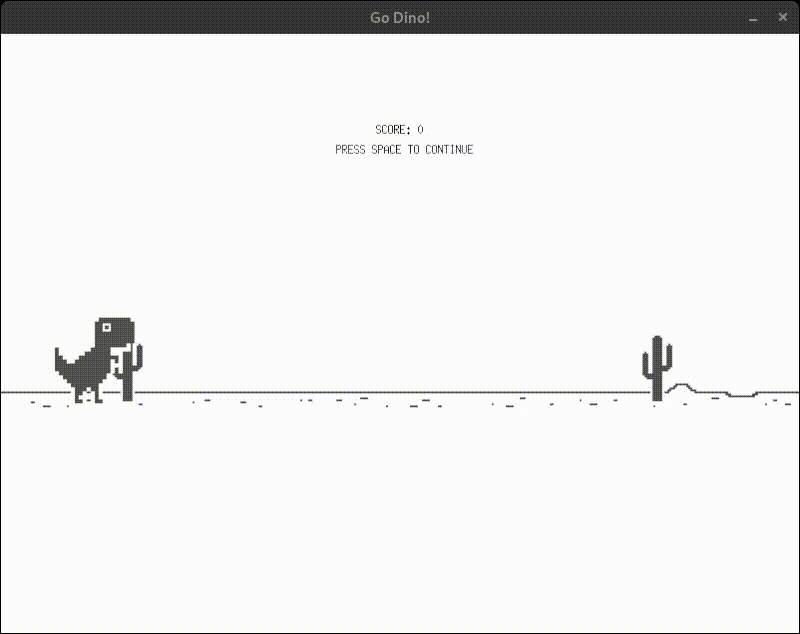

# Go Dino

An implementation of Chrome T-Rex runner game in GoLang using [ebiten](https://ebiten.org/)

### Controls

-   Press `SPACE` to jump
-   Press `Q` or `ESCAPE` to quit the game
-   Press `SPACE` to restart the game after death

### Demo

<div align="center">
    </img>
</div>

### Development Instructions

-   Install dependencies

```
go mod download
```

> **There are some additional ebiten dependencies required to install to run this game. Go to the [ebiten install page](https://ebiten.org/documents/install.html) and install the dependencies for your operating system.**

-   Run the game

```bash
make
```

-   Build the game

```bash
make build
```

> This generates the game binary named `dino`
